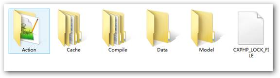
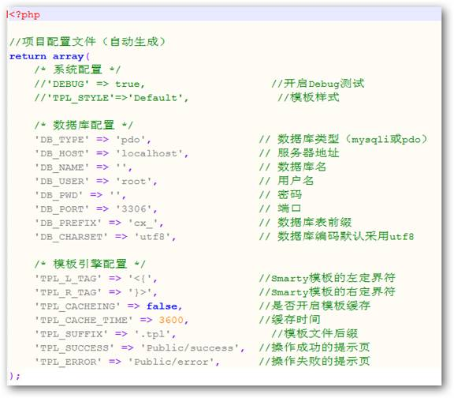
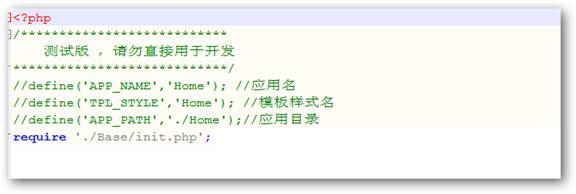

<html>

    <head>
        <meta http-equiv=Content-Type content="text/html; charset=gb2312">
        <meta name=Generator content="Microsoft Word 12 (filtered)">
        

    </head>

    <body lang=ZH-CN link=blue vlink=purple style='text-justify-trim:punctuation'>

        

            
<a name="OLE_LINK12">CXPHP</a>框架（简介）

            
一、&nbsp;&nbsp;&nbsp;&nbsp;&nbsp; 关于<a name="OLE_LINK11">CXPHP框架</a>

            
CXPHP是由LAMP兄弟连51期学员在培训学习时开发，以兄弟连BroPHP框架 、国内著名开源框架ThinkPHP作为参考，目前此框架仅作为学习研发使用。

            
CXPHP是一个免费开源的轻量级PHP框架，允许你把基于CXPHP框架开发的应用去开源或是商业产品发布或销售。CXPHP框架完全采用面向对象的设计思想，并且是基于MVC的三层设计模式。具有部署和应用及为简单、效率高、速度快，扩展性和可维护性都很好等特点，稍加修改后可以用于商业及门户的开发。CXPHP框架包括单入口文件、MVC模式、目录组织结构、类自动加载、强大基础类、URL处理、输入处理、错误处理、缓存机制、扩展类等功能。框架的应用使得WEB开发变得更简单、更快捷。

            
二、&nbsp;&nbsp;&nbsp;&nbsp;&nbsp; 环境要求

            
操作系统：支持Linux/Windows服务器,可以跨平台应用

            
WEB服务器：可运行于Apache、IIS和nginx中

            
PHP环境：PHP5.0以上版本，需要安装mysqli、PDO、GD扩展等模块

            
<a name="OLE_LINK5">三、&nbsp;&nbsp;&nbsp;&nbsp;&nbsp; 目录结构</a>

            
<a
                    name="OLE_LINK1">1.&nbsp;&nbsp;&nbsp; 框架入口 （Index）</a>

            
初始化前

            
<a name="OLE_LINK21"></a>

            
&Oslash;&nbsp;
                    index.php为框架系统单一入口文件，需导入Base目录下的init.php文件。

            
&Oslash;&nbsp;
                    Base目录为框架系统核心目录。

            
初始化后

            
<a
                    name="OLE_LINK2"></a>

            
&Oslash;&nbsp;
                    Home目录为框架系统默认生成的项目应用目录。

            
&Oslash;&nbsp;
                    Public目录为框架系统预留的资源目录，也包括文件上传的默认目录。

            
&Oslash;&nbsp;
                    config.php
                为项目的配置文件， 这里可以配置项目下的应用共有的参数。

            
&nbsp;

            
2.&nbsp;&nbsp;&nbsp; 核心目录<a name="OLE_LINK4">（Base）</a>

            

            
&Oslash;&nbsp;
                    Class 目录为框架的核心类文件。

            
&Oslash;&nbsp;
                    Common 目录存放着框架系统运行必要的函数。

            
&Oslash;&nbsp;
                    Config 目录用于存放框架系统的默认配置参数的配置文件，包括初始化参数文件。

            
&Oslash;&nbsp;
                    Extend 为框架系统的扩展目录，可以在里面放入自己的类文件，只要按照命名规则命名即可在实例类时会自动加载。

            
&Oslash;&nbsp;
                    Smarty 为Smarty库文件目录，存放着Smarty 2.6 的核心库文件（只有Smarty类能直接在上下文中使用）。

            
&Oslash;&nbsp;
                    init.php
                为框架系统的初始化文件，需要在单一入口文件中导入。(建议使用require）.

            
&nbsp;

            
&nbsp;

            
3.&nbsp;&nbsp;&nbsp; 项目应用目录 （APP）

            
<a
                    name="OLE_LINK26"></a>

            
&Oslash;&nbsp;
                    ~Runtime
                为应用运行时的缓存目录，开启DUBUG调试模式时几乎不会缓存（建议上线项目关闭DEBUG模式）。

            
&Oslash;&nbsp;
                    Action 为<a name="OLE_LINK22">应用源控制器类存放目录</a>，在应用运行时会压缩放入缓存目录。

            
&Oslash;&nbsp;
                    Common 目录存放应用需要的自定义的函数库文件。

            
&Oslash;&nbsp;
                    Extend 为应用的扩展目录，可以在里面放入自己的类文件，只要按照命名规则命名即可在实例类时会自动加载

            
&Oslash;&nbsp;
                    Model 为应用的数据操作模型类存入目录，在应用运行时会压缩放入缓存目录。

            
&Oslash;&nbsp;
                    View 为应用的视图存放目录，也包括相应的资源存放在这里 （可与项目公用资源目录结合使用）。

            
&Oslash;&nbsp;
                    Config.php
                为应用的配置文件，其配置信息的优先级很高，可以覆盖项目配置信息，但此配置信息仅至此应用有效。

            
<a name="OLE_LINK9">4.&nbsp;&nbsp;&nbsp;
                        缓存目录（~Runtime）</a>

            

            
&Oslash;&nbsp;
                    Action为应用控制器类压缩缓存存放目录。

            
&Oslash;&nbsp;
                    Cache 为Smarty的缓存目录（开启Smarty缓存时会在此目录中生成缓存文件）。

            
&Oslash;&nbsp;
                    Compile 为Smarty的编译文件存放目录。

            
&Oslash;&nbsp;
                    Data 为数据库表字段结构的存放目录，开启调试模式后不会在这里缓存。

            
&Oslash;&nbsp;
                    Model 为应用数据操作模型类的压缩缓存目录。

            
<a name="OLE_LINK7">四、&nbsp;&nbsp;&nbsp;&nbsp;&nbsp; 框架初始化</a>

            
全局配置文件:config.php（位于项目根目录下）

            
应用配置文件:config.php（位于应用根目录下），优先级较高。

            

            
<a name="OLE_LINK23">五、&nbsp;&nbsp;&nbsp;&nbsp;&nbsp; 单一入口文件</a>

            

            
在这里只需要导入框架的初始化文件即可以使用。

            
如果用户需要自定义目录结构，也可以通过设定常量也改变目录结构。

            
可配置的选项如下（常量）：

            
n&nbsp;
                    APP_NAME&nbsp; 应用的名称，当用户没有定义目录，会以它做为目录。

            
n&nbsp;
                    APP_PATH&nbsp;&nbsp;&nbsp; 应用的目录（相对于入口文件），默认为
                        ./Home 。

            
n&nbsp;
                    TPL_STYLE&nbsp;&nbsp;&nbsp; 模板的样式名称，默认为Default 。

            
n&nbsp;
                    DEBUG&nbsp;&nbsp;&nbsp;&nbsp;&nbsp;&nbsp;&nbsp;&nbsp; 是否开启DEBUG调试模式，默认为开启。

            
其它的选项均可在系统的两个系统配置文件中进行配置。

            
六、&nbsp;&nbsp;&nbsp;&nbsp;&nbsp; 项目部署应用目录

            
在部署网站时，项目的目录结构往往由不同项目的应用而决定。使用CXPHP框架时，项目的应用目录(Action、Model、View、Common、~Runtime、Extend、config.php
                        )和入口文件的位置，可以由不同项目的应用自己决定存放位置，而其他公用资源目录和配置文件（Public、config.php）必须同框架目录CXPHP在同一级。如果只有一个项目，建议使用默认部署。

            
七、&nbsp;&nbsp;&nbsp;&nbsp;&nbsp; URL访问

            
CXPHP框架的URL都是使用PATHINFO模式（index.php/index/index/）， 应用的访问方式都是采用单一入口的访问方式，所以访问一个应用中的具体模块以及模块中的某个操作，都需要在URL中通过入口文件后的参数来访问和执行。这样一来，所有访问都会变成由URL的参数来统一解析和调度。格式如下：

            
<a
                        href="http://www.c-x.in/入口文件/模块名/操作名/参数1/值1">http://www.c-x.in/入口文件/模块名/操作名/参数1/值1</a> 

            
#URL 统一解析和调度的PATHINFO模式

            
&nbsp;

            
<a name="OLE_LINK25">八、&nbsp;&nbsp;&nbsp;&nbsp;&nbsp;
                        默认开启</a>

            
在入口文件需要加载CXPHP的初始化文件 （init.php），在这个框架入口文件中有一些为整个应用默认开启的功能，所以在项目应用时就不需要再去设置了，没有必要的话默认的设置都不需要进行修改。如：

            
1.&nbsp;&nbsp;&nbsp;&nbsp;&nbsp; 默认开启输出字符集（utf-8），utf8是是网站和MySQL数据库的最佳选择。 

            
2.&nbsp;&nbsp;&nbsp;&nbsp;&nbsp; 设置时区（PRC），将PHP环境中的默认时间区改为中国时区。

            
3.&nbsp;&nbsp;&nbsp;&nbsp;&nbsp; 自动加载项目的配置文件（config.php），配置文件在项目中被自动包含，所以在用到配置文件中的选项时，都可以直接使用。

            
4.&nbsp;&nbsp;&nbsp;&nbsp;&nbsp; 自动包括类库和函数库，在项目中用到的所有类和函数都是自动包括的，项目开发时只要按规范去编写，都不需要去特意包含。

            
5.&nbsp;&nbsp;&nbsp;&nbsp;&nbsp; 自动开启Session，自动开户会话控制，如使用验证码类。

            
&nbsp;

            
九、&nbsp;&nbsp;&nbsp;&nbsp;&nbsp; 内建函数

            
CXPHP框架在内部的Common目录下的functions.inc.php文件中，提供了几个常用的快捷操作的全局函数，并在CXPHP的初始化文件init.php中自动包含了该文件，所以在任何位置都可以直接调用这几个函数。包括P()和D（）两个内置函数，详细的功能介绍和用法如下：

            
函数P：按照特定格式打印输出一个或多个任意类型（数组、对象、字符串等）的变量或数据，打印的值供程序员作为开发时的参考使用。使用方式如下：

            
&nbsp;

            
$arr=array(1,2,3,4,5,6);

            
P($arr);&nbsp;&nbsp;&nbsp;&nbsp;&nbsp;&nbsp;&nbsp;&nbsp;&nbsp;&nbsp;&nbsp;&nbsp;&nbsp;&nbsp;&nbsp;&nbsp;&nbsp;&nbsp;&nbsp;&nbsp;&nbsp;&nbsp;&nbsp;
                    #可以打印输出PHP数组

            
$object=new
                    Object();

            
P($object);&nbsp;&nbsp;&nbsp;&nbsp;&nbsp;&nbsp;&nbsp;&nbsp;&nbsp;&nbsp;&nbsp;&nbsp;&nbsp;&nbsp;&nbsp;&nbsp;&nbsp;&nbsp;&nbsp;&nbsp;
                    #可以打印输出PHP对象

            
$string=”this is
                    a string”;

            
P($string);&nbsp;&nbsp;&nbsp;&nbsp;&nbsp;&nbsp;&nbsp;&nbsp;&nbsp;&nbsp;&nbsp;&nbsp;&nbsp;&nbsp;&nbsp;&nbsp;&nbsp;&nbsp;&nbsp;&nbsp;&nbsp;
                    #可以打印输出PHP自己串

            
$other=其它类型;

            
P($other);&nbsp;&nbsp;&nbsp;&nbsp;&nbsp;&nbsp;&nbsp;&nbsp;&nbsp;&nbsp;&nbsp;&nbsp;&nbsp;&nbsp;&nbsp;&nbsp;&nbsp;&nbsp;&nbsp;&nbsp;&nbsp;
                    #可以打印输出PHP的任何类型

            
P($arr, $object,
                    $string, $other);&nbsp;&nbsp;&nbsp; #可以同时打印输出多个PHP变量

            
&nbsp;

            
&nbsp;

            
函数D：快速实例化Model类库，而且实例化Model类只能用这个函数。而且这个函数不仅可以实例化已声明的Model类，也可以实例化没有声明的Model类(只要参数对应的表名存在即可)。另外，不仅可以声明自己应用中的Model类，也可以声明其他应用中的Model类。该函数大量用于控制器中，使用方式如下：

            
&nbsp;

            
$book = D(“book”);&nbsp;&nbsp;&nbsp;&nbsp;&nbsp;&nbsp;&nbsp;&nbsp;&nbsp;&nbsp;&nbsp;&nbsp;
                        #如果在本应用的models中声明了一个类Book,则实例化book对象

            
$book = D(“book”);&nbsp;&nbsp;&nbsp;&nbsp;&nbsp;&nbsp;&nbsp;&nbsp;&nbsp;&nbsp;&nbsp;&nbsp;
                        #如果在本应用的models中没有声明Book类，但book表存在也行

            
$book = D(“book”, “admin”)&nbsp;&nbsp;&nbsp;&nbsp;&nbsp;
                        #如果有第二个参数， 可以实例admin应用下的book对象

            
&nbsp;

            
十、&nbsp;&nbsp;&nbsp;&nbsp;&nbsp; 控制器的声明（模块）

            
控制器就是类似于我们平常所说的控制器，系统会自动寻找项目应用的Action目录下面的相关类，如果没有找到，则会定位到空模块，否则输出错误提示。例如，一个网上书店中有用户管理(user)、类别管理(cat)和图书管理（book）三个模块，则需要创建三个控制器User类、Cat类和Book类和三个模块对应。 访问一个模块中的控制器和控制器中的操作都需要通过入口文件完成，控制器会管理整个用户的执行过程，负责模块的调度和操作的执行。另外，任何一个WEB行为都可以认为是一个模块的某个操作，也需要通过入口文件来执行，CXPHP系统中会根据当前的URL来分析要执行的模块和操作。在URL访问一节中介绍了CXPHP框架的URL访问格式。如下所示：

            
&nbsp;

            
<a
                            href="http://www.c-x.in/入口/模块/操作/参数1/值1">http://www.c-x.in/入口/模块/操作/参数1/值1</a> &nbsp;#URL 统一解析和调度的PATHINFO模式

            
<b><u>未 完 待 续</u></b>

        

    </body>

</html>
